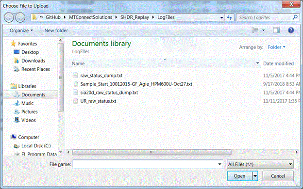
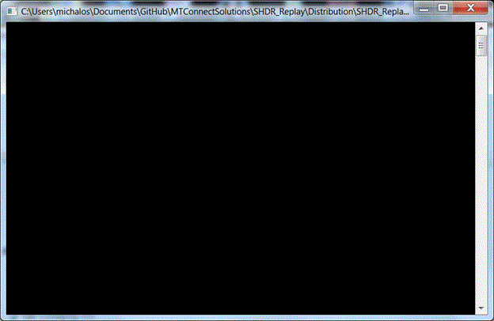
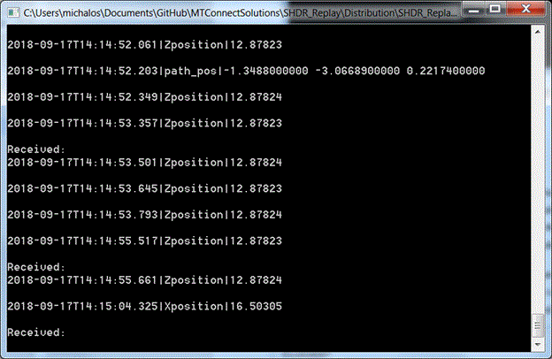





**ShdrEcho**
The ShdrEcho program accepts a MTConnect SHDR log file, and echo's it to any listening Agents. The ShdrEcho program replaces the first and every subsequent archival timestamp with the current time and duration offset. The ShdrEcho program waits between updates by the amount of time between timestamps in the MTConnect SHDR archival file. A sample line from a SHDR file would look like:

	12/2/2009 2:42:25 PM|power|ON|controllermode|AUTOMATIC|execution|EXECUTING|program|117Z2716-54_1-1|line|0|Srpm|1031|Tool|50
where there is a leading timestamp, and then either samples, events, conditions, information, or multi-line assets MTConnect data items are given. Samples and events are "tagname|value|" pairs while conditions are tagname|1|2|3| are a four field collection. This program just echos whatever follows the timestamp until the line feed. Information SHDR begin with a * instead of a timestamp, and this is detected. Multiline asset device information is not handled.
## Installing
Download the directory from github. It should contain a Windows Exe the required DLLs, and a a VB Script file to orchestrate the playback.
The file are:

	Config.ini
	msvcp100.dll
	msvcr100.dll
	msvcrt.dll
	RerunShdr.vbs
	Sample_Start_10012015-GF_Agie_HPM600U-Oct27.txt
	SHDR_Replay.exe
The Config.ini file is for standalone use with the SHDR_Replay.exe application. If you run the ResunShdr.vbs script it will ask for a SHDR log file and recreate the Config.ini log file.
The Sample_Start_10012015-GF_Agie_HPM600U-Oct27.txt is a sample SHDR log file.
Hopefully all the required MSVC DLLs are included.
## Running
Double click ResunShdr.vbs.
You will see a pop up dialog in which to pick a SHDR log file (no error checking for correct choice):

Once you have established a playback it listens on IP=127.0.0.1 (localhost) on PORT (7878) for any connection. If there are no connections you will see a blank console:

Once a MTConnect agent establishes a connection (or telent) the console will echo what is being output to the agent:

Echoing 
## Background App
This program was developed in Microsoft Windows Visual Studio C++ 10.0. Most but not all MSVC dependencies have been removed. The inclusion of precompiled headers (which really speeds things up) may be included, and there is no easy way to mitigate, such #define way to add "stdafx.h", was found. You could rename the file stdafx.h and use it as the precompiled header, but life is short.
The ShdrEcho program reads a Config.ini file that is in the same folder as the ShdrEcho.exe executable. The Conifg.ini file is a Below is a sample config.ini file. There is only one section [GLOBALS]. Within the section are 4 variables, Filename, Repeat, Wait, PortNum and IP to

	[GLOBALS]
	Filename= C:\Users\michalos\Documents\GitHub\MTConnectSolutions\ShdrEcho\ShdrEcho\x64\Debug\out.txt
	Repeat=1
	Wait=0
	PortNum=7878
The GLOBALS section variables have the following meaning:
The filename variable specifies the filename (including path) of the SHDR archival file.
Repeat variable determines whether the echo will restart when the archival file is finished.
The Wait variable is used to tell the program to wait for a connection before reading the SHDR archival file
The PortNum is the TCP/IP socket port of the MTConnect SHDR connection that the program will listen to.
Note, the IP of the ShdrEcho program must always be localhost or 127.0.0.1.


